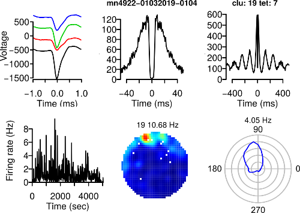

# relectro

R package to analyze electrophysiological data. The focus is on data from tetrode recording experiments in behaving animals. Most of the package is written in R but some sections are written in C for speed. Analysis can easily be run in parallel with the snow package. 

---

Here is an example of figure you can generate using relectro. You can see the mean spike waveforms, the spike-time autocorrelations, instantaneous firing rate, spatial firing rate map and head-direction polar plot.

## Install

* Get the source code with the git clone command: `git clone http://github.com/kevin-allen/relectro.git`

You will need to install the fftw3 C library to compute discrete Fourier transforms with relectro. You can install it on a linux machine.

* With Fedora: `dnf install -y fftw3-devel` 
* With Ubuntu: `apt-get install libfftw3-dev`

* From R studio, click File/Open project... and select relectro.Rproj

If you just want to use the functions and objects of relectro, go in the terminal and 
run the following

* R CMD build relectro
* R CMD INSTALL relectro

You might need to add a few R packages to be able to build relectro. Here is a list of what was missing on a Fedora installation. In R, use install.packages().

* rmarkdown
* snow
* plotrix
* knitr
* abind
* testthat
* oce
* plyr
* circular

If you want to modify the code of relecto, I recommand using R studio together with the book "R Packages" by Hadley Wickham. Most of the tools used to develop relectro are presented in this book. You probably want to use the R package devtools for development.

## Feedback

Please report any issues or suggestions at http://github.com/kevin-allen/relectro/issues.

## Warning

There is no warranty that the code is bug-free.
The tests run on the functions can be found in the `tests` directory.

